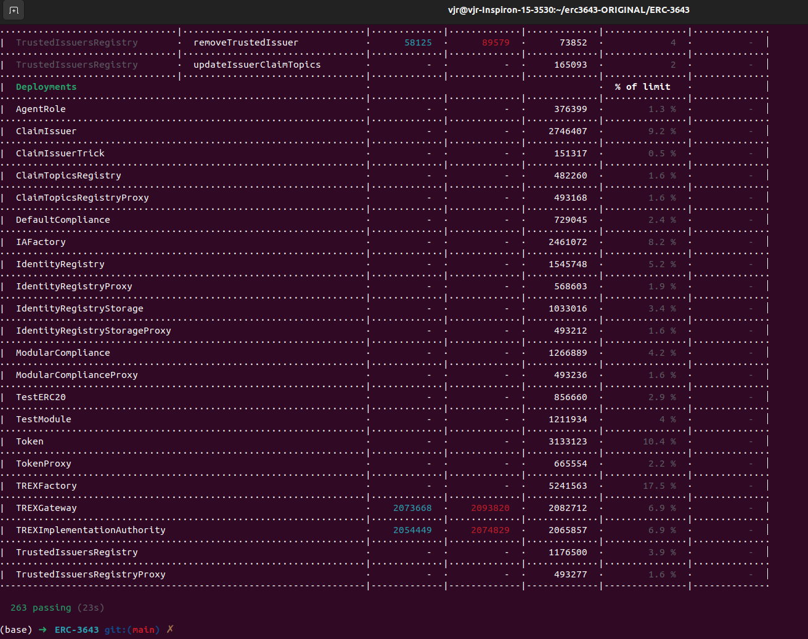
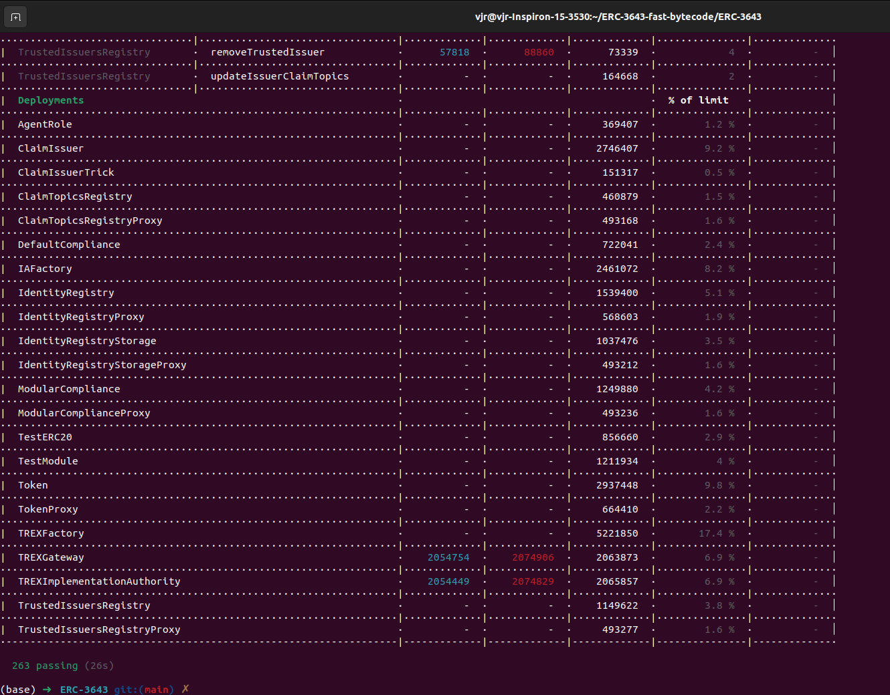

# T-REX-gas-optimized

Este repositório contém os contratos inteligentes do protocolo ERC-3643 (T-REX) otimizados para baixo consumo de gas. As otimizações foram realizadas utilizando técnicas de baixo nível (Yul/Assembly) e análise detalhada de opcodes da EVM para garantir a máxima eficiência sem comprometer a segurança.

## Relatórios de Consumo de Gas

Abaixo estão os prints dos testes de performance que demonstram a redução no consumo de gas nas operações do protocolo:

## Segurança e Auditoria

Além da eficiência em gas, o código foi validado por ferramentas de análise estática e simbólica, garantindo que as otimizações não introduziram novas vulnerabilidades. Em muitos casos, a refatoração para baixo nível permitiu um controle mais preciso da memória e do fluxo de execução, melhorando o perfil de segurança:

- **Mythril**: A análise simbólica mostrou que o número de bugs foi reduzido (de dois bugs na versão original para apenas um na versão otimizada).
- **Slither**: A contagem de erros severos e avisos foi reduzida significativamente após as otimizações.

Os relatórios detalhados comparativos estão disponíveis no diretório:
- `audit_reports/slither_original.txt` vs `slither_optimized.txt`
- `audit_reports/myth_original.txt` vs `myth_optimized.txt`

## Estrutura do Repositório

O foco deste repositório é fornecer exclusivamente os contratos inteligentes:

- `contracts/`: Diretório contendo todos os arquivos `.sol` do protocolo T-REX.
  - `compliance/`: Módulos e lógica de conformidade.
  - `factory/`: Fábricas para deploy do ecossistema.
  - `registry/`: Registros de identidade e emissores.
  - `token/`: Implementação do token ERC-3643.
  - `roles/`: Gerenciamento de permissões.
  - `proxy/`: Implementações de proxy para upgradeability.

---
*Este repositório foi criado para servir como referência de alta performance para o padrão ERC-3643.*
